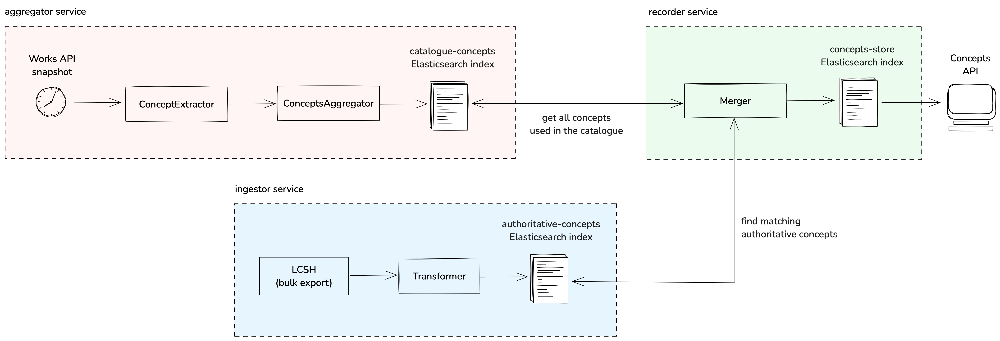
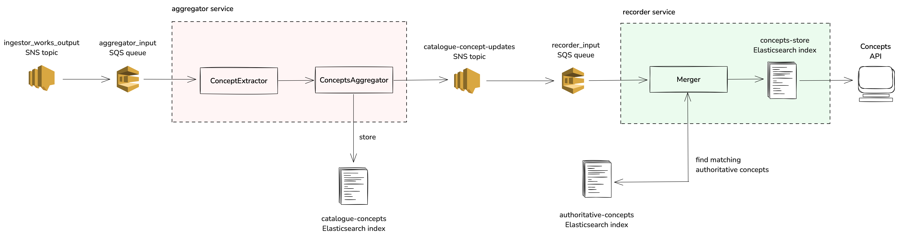
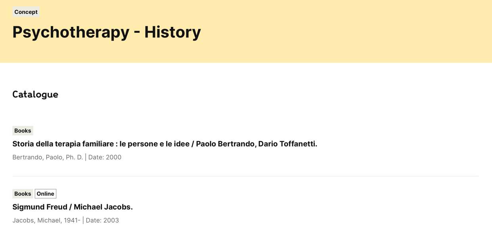

# concepts-pipeline

> [!NOTE]
>  **This repository is now deprecated.** Building on the work of this repository, these services have been replaced by the [catalogue-graph](https://github.com/wellcomecollection/catalogue-pipeline/tree/main/catalogue_graph).

---

_Some sort of ETL pipeline for concepts in the Wellcome Collection catalogue_

Running data through this pipeline results in an index to serve the concepts API with concept data, harvested from an external authority (Initially Library of Congress, then MeSH, and Wikidata, with the possibility of adding other sources as we see fit).

See https://github.com/wellcomecollection/docs/tree/main/rfcs/052-concepts-pipeline for more information.

## Architecture overview

The _concepts-pipeline_ currently consists of three Scala services, all configured to run in AWS as Lambda functions.
In production, the pipeline can operate in two modes — _bulk_ (for processing all catalogue items) and _SQS_ (for processing a small number of catalogue items).
The two modes are deployed as separate Lambda functions.

The pipeline can also run locally (either via Docker or directly via sbt). When running locally, all three services use
a local Elasticsearch cluster, which first needs to be started via this command:
```
docker compose run -d --service-ports elasticsearch
```

The local cluster is accessible on http://localhost:9200/ and can be queried via [Elasticsearch Query DSL](https://www.elastic.co/guide/en/elasticsearch/reference/current/query-dsl.html).  

Kibana for the production Elasticsearch cluster can be reached via [Elastic Cloud](https://cloud.elastic.co/deployments) (look for the deployment titled `concepts-[date]`). 

### Architecture diagrams

The first diagram shows how the pipeline operates in bulk mode. The second diagram shows how it operates in SQS mode.

#### Bulk mode


#### SQS mode


### `ingestor` service

The `ingestor` service downloads concepts from external authorities (currently only the Library of Congress) and stores them into Elasticsearch.

Library of Congress concepts are downloaded as two large archive files:
* A GZ file storing all LoC Subject Headings (see [here](https://id.loc.gov/authorities/subjects.html) for more information)
* A GZ file storing all LoC Names (see [here](https://id.loc.gov/authorities/names.html) for more information)

The individual concepts are extracted from both archives, fed through a small Transformer (which extracts their IDs, labels, and alternative labels), and placed into Elasticsearch under the `authoritative-concepts` index.

> [!NOTE]  
> LoC Subject Headings contain some potentially useful fields we are currently not extracting. For example, the `skos:broader` field stores a list of broader terms (i.e. parent nodes in the hierarchy tree).    

For more information, see the [ingestor README file](ingestor/README.md).

### `aggregator` service

The `aggregator` service downloads a snapshot of all catalogue items and extracts all concepts from them via the ConceptExtractor.

It then deduplicates the extracted concepts and stores them in the `catalogue-concepts` index.

For more information, see the [aggregator README file](aggregator/README.md).

### `recoder` service

The `recorder` service fetches all concepts stored in the `catalogue-concepts` index (populated by the `aggregator`).
For each fetched concept, it tries to find a matching concept from the `authoritative-concepts` index (populated by the `ingestor`).

The matching logic is based only on the authoritative ID of the concept (e.g. LoC Subject Heading ID). If two concepts have the same label
but not the same authoritative ID, they are **not** matched. 

If a matching authoritative concept is found, both items are merged before being inserted into the `concepts-store` index. 
While merging, the label of the authoritative concept takes precedence over the label of the catalogue concept.

If a matching authoritative concept is not found, the catalogue concept still gets inserted into the `concepts-store` index.

The `concepts-store` index is the final index queried by the Catalogue API. 

## Explanation of current idiosyncrasies
### Empty concept pages

Clicking a concept link on a work page sometimes leads to an empty concept page. For example, visiting the
[Sigmund Freud / Michael Jacobs.](https://wellcomecollection.org/works/hze5z2xm) work page and clicking on the
`Psychotherapy | history` subject links to [this empty concept page](https://wellcomecollection.org/concepts/bmpuc2hn):


However, clearly there _is_ at least one work associated with the `Psychotherapy | history` concept —
the [Sigmund Freud / Michael Jacobs.](https://wellcomecollection.org/works/hze5z2xm) item which links to it. The reason
this item does not appear on the concept page is because there are actually three* different concept pages for the `Psychotherapy | history` concept:
* [Psychotherapy - history](https://wellcomecollection.org/concepts/am2zsdgn)
* [Psychotherapy - History](https://wellcomecollection.org/concepts/nkpfmrtk)
* [Psychotherapy--History](https://wellcomecollection.org/concepts/bmpuc2hn)

*(This is a simplification. There are six different pages for this concept, but only three pages listing distinct catalogue items.)

Only the last page is empty, and the other two pages show a different (and non-intersecting) set of catalogue items
(the first page lists 116 items, and the second page only lists 5). Moreover, the second page lists the aforementioned
[Sigmund Freud / Michael Jacobs.](https://wellcomecollection.org/works/hze5z2xm) item, which shows that this item is in
fact associated with a concept page:



This raises two questions:
1. Why are there three different concept pages for the same `Psychotherapy | history` concept?
2. Why does clicking a concept on a work page take us to an "incorrect" (empty) concept page instead of taking us to a page listing the work in question?

The first question can be answered by explaining the mechanism behind deciding which items get listed on a concept page.
As mentioned previously, there are actually six different concept pages associated with the `Psychotherapy | history` concept,
each of which has a different canonical ID and a different URL. But some of these pages are identical (listing the same catalogue items).

This is because the mechanism determining which catalogue items are listed on a concept page is based on the concept's _label_. Therefore,
if two separate concepts with separate IDs have the same label, their respective concept pages will always list the same items.
But two concepts with (even slightly) different labels will never list the same items. This explains why there are three 
distinct pages for the `Psychotherapy | history` concept — note the slight differences in capitalisation and dashes between
the labels on the three pages.

So why do we have three `Psychotherapy | history` concepts with slight spelling variations? This is because these concepts
come from different sources:
* [Psychotherapy - history](https://wellcomecollection.org/concepts/am2zsdgn) is derived from MeSH (and label-derived)
* [Psychotherapy - History](https://wellcomecollection.org/concepts/nkpfmrtk) is label-derived
* [Psychotherapy--History](https://wellcomecollection.org/concepts/bmpuc2hn) is derived from an LoC Subject Heading

These exist as separate concepts because we only merge concepts based on authoritative IDs (see `recoder` service section above).
Even if these three concepts had exactly the same spelling, we would not merge them into one concept, because we do not 
merge concepts based on labels (though in this case they would _appear_ as just one concept in the frontend due to the 
label-based listing mechanism explained above).

The second question can be answered by noting that work pages use a _different_ mechanism for linking to concept pages.
Instead of using labels, this mechanism uses authoritative IDs. For example, the `Psychotherapy | history` subject
listed on the [Sigmund Freud / Michael Jacobs.](https://wellcomecollection.org/works/hze5z2xm) work page comes from LoC 
Subject Headings and has a corresponding LoC authoritative ID associated with it. Therefore, clicking on this subject 
leads to the LoC-derived concept [Psychotherapy--History](https://wellcomecollection.org/concepts/bmpuc2hn).

However, the primary label of this subject (which is inherited from the main LoC label) is "Psychotherapy--History",
which is different from the label used on the work page ("Psychotherapy - History"). This explains why the LoC-derived concept page
does not link back to the work, but a different concept page (with a different authoritative ID but the same label) does.

**In general, if a work links to a specific concept page, the concept page will only link back to the work if the 
primary label for the concept and the label used on the work page are identical.** 


### Outdated labels on concept pages

The labels on some LoC-derived concept pages are outdated. For example, the concept page corresponding to the [Older gay people](https://id.loc.gov/authorities/subjects/sh2002002101.html)
Subject Heading still has the old [Older gays](https://wellcomecollection.org/concepts/jnvnwjmq) label.

This is because it has been a while since we ran the `ingestor` in production (the corresponding Lambda function is not set up to run on a schedule),
so the `authoritative-concepts` index still contains the outdated term. Simply re-running the concepts pipeline in production to update the labels should fix this issue without any additional changes.   
